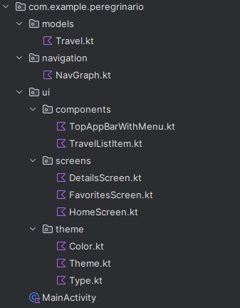

# Peregrinário

Aplicativo de Diário de Viagens desenvolvido para o Trabalho Final da disciplina de Desenvolvimento de Software para Dispositivos Móveis na UFC Quixadá, 2024.2.

**Dupla**: 
Francisco Vitor Gomes Castro  
Kalmax dos Santos souza

## Funcionalidades Principais

### 1. Gerenciamento de Conteúdo em uma Viagem (detalhes) (Implementado)
- O usuário poderá visualizar as informações de uma viagem:
  - Nome do destino
  - Descrição
  - Datas da viagem
  - Imagens
  - Áudios
  - Status de Favorita
- (Planejamento) O usuário deve poder editar/adicionar elementos na timeline de uma viagem:
  - Fotos com descrição e localização
  - Áudios gravados ou carregados
- (Planejamento) O usuário deve visualizar os elementos na timeline organizados por ordem cronológica.

### 2. Visualização de Viagens (Implementado)

- O usuário deve poder visualizar as viagens cadastradas em formato de cards, contendo:
  - Nome do destino
  - Datas da viagem
  - Descrição
  - 1 Foto destaque
- O usuário deve poder pesquisar viagens por destino.
- O usuário deve poder visualizar viagens favoritas.
- (Planejamento) O usuário deve poder pesquisar viagens por data.

### 3. Menu Três Pontinhos (Implementado)

-  Menu contendo a navegação entre as telas: 
   - Home
   - Favoritos
   - Configurações
   - Ajuda
   - Logout (simulado)
- (Planejamento) Navegação adicional: 
  - Perfil de usuário
  - Login
  

### 4. Tela de Configurações (Implementado)

- Mudança de temas de cor (Claro e Escuro)
- Habilitar e desabilitar notificações
- Redefinir preferências e favoritos

### 5. Tela de Suporte (Implementado)

- Simulação de ajuda (FAQ)
- Simular envio de dúvidas por formulário (dispara notificação)

### 6. Cadastro de Viagens (Planejamento)

- O usuário deve ser capaz de cadastrar uma nova viagem informando:
  - Nome do destino
  - Data de início 
  - Data do término
  - Lista de **Registros** (Imagens e Áudios com descrição e localização) 
  - Marcar como favorita

### 7. Tela de Perfil (Planejamento)

- O usuário deve visualizar:
  - Foto do perfil
  - Estatísticas de viagens realizadas no ano
  - Classificação de acordo com o número de viagens realizadas.

### 8. Mapa Interativo (Planejamento)

- O usuário deve poder abrir uma visualização de mapa mostrando os locais já visitados.
- Deve haver um botão para acessar o mapa (local a definir).

### 9. Exportação de Diário (Planejamento)

- O usuário deve poder exportar o diário de uma viagem para PDF.
- Deve permitir escolher quais conteúdos incluir na exportação (fotos, áudios e descrições).

### 10. Compartilhamento de Viagens (Planejamento)

- O usuário deve poder compartilhar detalhes de uma viagem em redes sociais.
- Deve permitir a seleção dos elementos a serem compartilhados.

## Estrutura do Projeto

O projeto foi desenvolvido utilizando o framework Jetpack Compose com uma organização semelhante à demonstrada em sala de aula e em atividades anteriores.

O aplicativo usa um arquivo NavGraph que centraliza e define a navegação entre as telas usando um componente de top bar com um menu de três pontinhos.

A tela inicial (Home) contém uma barra de pesquisa para pesquisar viagens e uma lista de cards (Componente de card de viagem) com as viagens cadastradas. Os cards possuem um botão que permite navegar para a tela de detalhes e outro capaz de marcar a viagem como favorita.

### Estrutura de pastas

## Divisão de Trabalho

Durante o decorrer do trabalho, a dupla definiu tarefas individuais e também em conjunto, como o planejamento da estrutura do projeto. 

### Francisco Vitor Gomes Castro
- Configuração de Ambiente e implementação inicial
- Gerenciamento de Conteúdo em uma Viagem (Detalhes)
- Visualização de Viagens
- Tela de favoritos
- Menu Três Pontinhos (implementação)
- Paleta de cores e personalização (implementação inicial)

### Kalmax dos Santos Souza
- Menu Três Pontinhos (complementação)
- Paleta de cores e personalização (complementação)
- Tela de Configurações (alternância de temas e notificações)
- Tela de Suporte (simulação de ajuda e envio de dúvidas)
- Gravação de video demonstração
